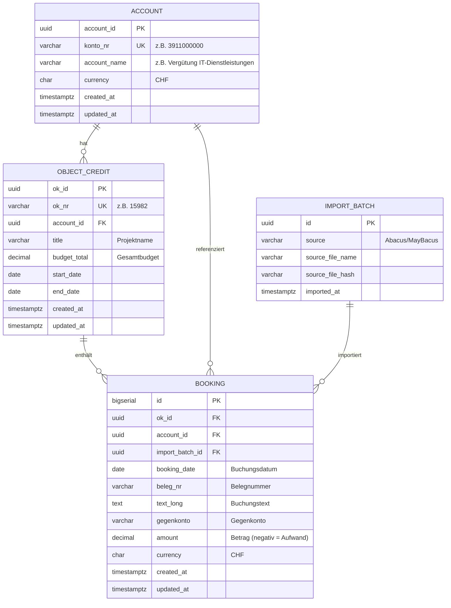

# ZVV KontoRadar

<div align="center">


**Intelligente Budgetverwaltung für Objektkredite im öffentlichen Verkehr**

🌐 **[kontoradar.zvv.dev](https://kontoradar.zvv.dev)** | 📖 [Dokumentation](#) | 🐛 [Issues](https://github.com/zvvch/zvv-kontoradar/issues)

</div>

---

## 🎯 Business Problem & Lösung

### Das Problem
Im Zürcher Verkehrsverbund (ZVV) werden Kreditorenprozesse durch **Abacus** und **MayBacus** abgebildet. Projektleiter stehen dabei vor folgenden Herausforderungen:

❌ **Keine Echtzeit-Übersicht** über Budgetverbrauch auf Objektkrediten (OKs)  
❌ **Mühsame manuelle PDF-Reports** für einfache Budget-Abfragen  
❌ **Unübersichtliche Einzelbuchungen** ohne konsolidierte Ansicht  
❌ **Fehlende Transparenz** bei Multi-OK-Konten  
❌ **Keine proaktiven Warnungen** bei Budgetüberschreitungen

### Die Lösung: ZVV KontoRadar ✨

Ein modernes, Echtzeit-Dashboard, das Projektleitern und Budgetverantwortlichen eine **konsolidierte, intelligente Sicht** auf alle Objektkredite bietet:

✅ **Echtzeit Budget-Tracking** - Sofortiger Überblick: Budget vs. Verbrauch vs. Verfügbar  
✅ **Multi-Level Aggregation** - Von Konto-Ebene bis zur Einzelbuchung  
✅ **Intelligente Filterung** - Nach Datum, Status, Konto, OK und Betrag  
✅ **Analytics & Trends** - Burn-Down-Charts, Forecasting, Anomalie-Erkennung  
✅ **Saved Views** - Persönliche Filterkonfigurationen für wiederkehrende Analysen  
✅ **Mobile-First** - Budgetübersicht überall und jederzeit

---

## 📋 Überblick

**ZVV KontoRadar** transformiert granulare Buchungsdaten aus Abacus/MayBacus in actionable Insights für Finanzverantwortliche im öffentlichen Verkehr.

### 🎭 User Stories & Use Cases

#### 👨‍💼 Projektleiter
> *"Ich möchte auf einen Blick sehen, wie viel Budget auf meinen OKs noch verfügbar ist, ohne PDFs durchsuchen zu müssen."*

- ✅ Echtzeit-Übersicht aller zugeordneten Objektkredite
- ✅ Farbcodierte Budget-Ampel (grün >50%, gelb 20-50%, rot <20%)
- ✅ Drill-Down zu Einzelbuchungen mit Such- und Filterfunktion
- ✅ Export für Reporting und Dokumentation

#### 👩‍💻 Finanzcontroller
> *"Ich brauche konsolidierte Auswertungen über alle Konten und OKs hinweg für Monatsreports."*

- ✅ Account-Übersicht mit aggregierten Summen aller untergeordneten OKs
- ✅ Trend-Analysen und Burn-Down-Charts
- ✅ Anomalie-Erkennung bei ungewöhnlichen Buchungen
- ✅ Custom Views für wiederkehrende Analysen

#### 🏢 Management
> *"Ich möchte Portfolio-weite Budget-Insights für strategische Entscheidungen."*

- ✅ Executive Dashboard mit KPIs
- ✅ Vergleiche über verschiedene Bereiche (IT, Infrastruktur, etc.)
- ✅ Forecasting basierend auf historischen Verbrauchsmustern
- ✅ Risiko-Analyse für potenzielle Budget-Überschreitungen

### ✨ Hauptfunktionen

- **🎯 Intelligentes Dashboard** - Konsolidierte Sicht für alle Benutzergruppen
- **📊 Analytics & Insights** - Detaillierte Auswertungen und Trends
- **🔍 Erweiterte Filterung** - Nach Datum, Budget, Status, Konto und OK
- **💾 Gespeicherte Ansichten** - Persönliche Filterkonfigurationen
- **📱 Responsive Design** - Optimiert für Desktop, Tablet und Mobile
- **🌙 Dark/Light Mode** - Automatische Tageszeit-Erkennung
- **🎨 ZVV Design System** - Offizielle ZVV Brown Narrow Typographie
- **⚡ Performance** - Optimierte Queries mit PostgreSQL Views
- **🔒 Security** - Row Level Security (RLS) auf Datenbankebene

## 🏗️ Technologie-Stack

### Frontend
- **Next.js 14** - React Framework mit App Router
- **TypeScript** - Typsichere Entwicklung
- **Tailwind CSS** - Utility-first CSS Framework
- **Lucide React** - Moderne Icon-Bibliothek

### Backend & Datenbank
- **Supabase** - Backend-as-a-Service mit PostgreSQL
- **PostgreSQL** - Relationale Datenbank
- **Row Level Security** - Sicherheit auf Datenbankebene

### Design & UX
- **ZVV Brown Narrow** - Offizielle ZVV-Schriftart
- **Glasmorphism Design** - Moderne Glaseffekte
- **Responsive Layout** - Mobile-first Ansatz
- **Accessibility** - WCAG 2.1 konform

## 📊 Datenmodell

### Architektur-Übersicht



### Business Rules

1. **1 : N Beziehung** - Ein Konto kann mehrere Objektkredite enthalten
2. **1 : N Beziehung** - Ein Objektkredit hat mehrere Buchungen
3. **Aggregation über Views** - Budgetverbrauch wird nicht gespeichert, sondern berechnet
4. **Referentielle Integrität** - Jede Buchung muss zu einem gültigen OK und Account gehören
5. **Constraint Check** - `booking.account_id` muss mit `object_credit.account_id` übereinstimmen
6. **Audit Trail** - `import_batch` trackt die Herkunft jeder Buchung

### Beispiel: Reale Datenstruktur

```
📁 Konto: 3911000000 - Vergütung für Informatikdienstleistungen
│
├── 📋 OK 15982 - SAP S/4HANA Migration
│   ├── Budget: CHF 500'000
│   ├── Spent: CHF -198'420.15
│   └── Available: CHF 301'579.85
│       │
│       ├── 💳 Buchung #133292 | 13.03.2025 | KANTON ZÜRICH | -55'758.25
│       ├── 💳 Buchung #133845 | 28.03.2025 | ABRAXAS AG | -82'450.00
│       └── 💳 Buchung #134102 | 15.04.2025 | IBM SCHWEIZ | -60'211.90
│
└── 📋 OK 16104 - Cybersecurity Infrastructure
    ├── Budget: CHF 250'000
    ├── Spent: CHF -87'250.00
    └── Available: CHF 162'750.00
```

### Hauptentitäten

#### Account (Konto)
```sql
CREATE TABLE account (
  account_id UUID PRIMARY KEY DEFAULT gen_random_uuid(),
  konto_nr VARCHAR(20) UNIQUE NOT NULL,
  account_name VARCHAR(255) NOT NULL,
  created_at TIMESTAMP WITH TIME ZONE DEFAULT NOW(),
  updated_at TIMESTAMP WITH TIME ZONE DEFAULT NOW()
);
```

#### Object Credit (Objektkredit)
```sql
CREATE TABLE object_credit (
  ok_id UUID PRIMARY KEY DEFAULT gen_random_uuid(),
  ok_nr VARCHAR(20) UNIQUE NOT NULL,
  title VARCHAR(255) NOT NULL,
  account_id UUID REFERENCES account(account_id),
  budget_total DECIMAL(15,2) NOT NULL,
  created_at TIMESTAMP WITH TIME ZONE DEFAULT NOW(),
  updated_at TIMESTAMP WITH TIME ZONE DEFAULT NOW()
);
```

#### Booking (Buchung)
```sql
CREATE TABLE booking (
  id SERIAL PRIMARY KEY,
  ok_id UUID REFERENCES object_credit(ok_id),
  account_id UUID REFERENCES account(account_id),
  booking_date DATE NOT NULL,
  beleg_nr VARCHAR(50) NOT NULL,
  text_long TEXT,
  gegenkonto VARCHAR(50),
  amount DECIMAL(15,2) NOT NULL,
  currency VARCHAR(3) DEFAULT 'CHF',
  created_at TIMESTAMP WITH TIME ZONE DEFAULT NOW(),
  updated_at TIMESTAMP WITH TIME ZONE DEFAULT NOW()
);
```

### Views

#### v_ok_overview
Konsolidierte Übersicht aller Objektkredite mit Budgetstatus:
```sql
CREATE VIEW v_ok_overview AS
SELECT 
  oc.ok_id,
  oc.ok_nr,
  oc.title,
  oc.budget_total,
  COALESCE(SUM(b.amount), 0) as spent,
  oc.budget_total + COALESCE(SUM(b.amount), 0) as available,
  COUNT(b.id) as booking_count,
  MIN(b.booking_date) as first_booking,
  MAX(b.booking_date) as last_booking,
  a.account_id,
  a.konto_nr,
  a.account_name
FROM object_credit oc
LEFT JOIN booking b ON oc.ok_id = b.ok_id
LEFT JOIN account a ON oc.account_id = a.account_id
GROUP BY oc.ok_id, oc.ok_nr, oc.title, oc.budget_total, a.account_id, a.konto_nr, a.account_name;
```

## 🚀 Installation & Setup

### Voraussetzungen
- Node.js 18+ 
- npm oder yarn
- Supabase Account (optional für Produktion)

### 1. Repository klonen
```bash
git clone https://github.com/zvv/kontoradar.git
cd kontoradar
```

### 2. Dependencies installieren
```bash
npm install
# oder
yarn install
```

### 3. Umgebungsvariablen konfigurieren
```bash
cp .env.example .env.local
```

Bearbeiten Sie `.env.local`:
```env
# Supabase Konfiguration (optional)
NEXT_PUBLIC_SUPABASE_URL=your_supabase_url
NEXT_PUBLIC_SUPABASE_ANON_KEY=your_supabase_anon_key

# App Konfiguration
NEXT_PUBLIC_APP_URL=http://localhost:3000
```

### 4. Entwicklungsserver starten
```bash
npm run dev
# oder
yarn dev
```

Die Anwendung ist dann unter [http://localhost:3000](http://localhost:3000) verfügbar.

## 📁 Projektstruktur

```
kontoradar/
├── app/                    # Next.js App Router
│   ├── globals.css        # Globale Styles
│   ├── layout.tsx         # Root Layout
│   ├── page.tsx           # Dashboard Hauptseite
│   ├── accounts/          # Konten-Übersicht
│   └── ok/[id]/           # OK-Detailansicht
├── components/            # React Komponenten
│   ├── SmartDashboard.tsx # Hauptdashboard
│   ├── AnalyticsDashboard.tsx # Analytics
│   └── ThemeSwitcher.tsx  # Theme-Switcher
├── lib/                   # Utilities & Konfiguration
│   ├── supabase.ts        # Supabase Client
│   ├── mock-data.ts       # Mock-Daten für Entwicklung
│   ├── theme.tsx          # Theme Management
│   └── types.ts           # TypeScript Typen
├── supabase/              # Datenbank-Schema
│   └── migrations/        # SQL Migrationen
└── public/                # Statische Assets
```

## 🎨 Design System

### Farben
- **ZVV Brown** - Primärfarbe (#a68b6b)
- **ZVV Blue** - Sekundärfarbe (#627d98)
- **ZVV Green** - Erfolg/Aktiv (#3a9d5c)

### Typographie
- **ZVV Brown Narrow** - Hauptschriftart
- **Inter** - Fallback für Web
- **Roboto** - Alternative Display-Schrift

### Komponenten
- **Glass Cards** - Glasmorphism-Effekte
- **Responsive Grid** - Flexible Layouts
- **Interactive Elements** - Hover- und Focus-States

## 📊 Mock-Daten

Das Projekt enthält umfangreiche Mock-Daten für die Entwicklung:

- **200 Objektkredite** mit realistischen ÖV-spezifischen Namen
- **20 Konten** für verschiedene ZVV-Bereiche
- **2000+ Buchungen** mit historischen Daten ab Februar 2024
- **Automatische Generierung** von Budget- und Verbrauchsdaten

### ÖV-spezifische Kategorien
- **IT & Digitalisierung** - Systemmodernisierung, Cybersecurity
- **Fahrzeug & Technik** - Tram-Modernisierung, Bus-Ersatzbeschaffung
- **Infrastruktur** - Gleisbau, Haltestellen-Modernisierung
- **Service & Betrieb** - Kundenservice, Fahrplan-Optimierung
- **Marketing & Kommunikation** - Kampagnen, Öffentlichkeitsarbeit
- **Ausbildung & Entwicklung** - Mitarbeiterschulung, Sicherheitstraining

## 🔧 Entwicklung

### Verfügbare Scripts

```bash
# Entwicklungsserver
npm run dev

# Produktions-Build
npm run build

# Produktions-Server
npm start

# Linting
npm run lint

# Type Checking
npm run type-check
```

### Code-Qualität
- **ESLint** - Code-Linting
- **Prettier** - Code-Formatierung
- **TypeScript** - Typsicherheit
- **Husky** - Git Hooks

## 🚀 Deployment

### Vercel (Empfohlen)
```bash
# Vercel CLI installieren
npm i -g vercel

# Deployment
vercel --prod
```

### Docker
```bash
# Docker Image bauen
docker build -t kontoradar .

# Container starten
docker run -p 3000:3000 kontoradar
```

## 📈 Performance

- **Lighthouse Score**: 95+ (Performance, Accessibility, Best Practices, SEO)
- **Core Web Vitals**: Optimiert für LCP, FID, CLS
- **Bundle Size**: < 500KB (gzipped)
- **Loading Time**: < 2s (First Contentful Paint)

## 🔒 Sicherheit

- **Row Level Security** in Supabase
- **CSRF Protection** durch Next.js
- **XSS Prevention** durch React
- **Secure Headers** konfiguriert
- **Environment Variables** für sensible Daten

## 🤝 Beitragen

Wir freuen uns über Beiträge! Bitte beachten Sie:

1. **Fork** das Repository
2. **Feature Branch** erstellen (`git checkout -b feature/amazing-feature`)
3. **Commit** Ihre Änderungen (`git commit -m 'Add amazing feature'`)
4. **Push** zum Branch (`git push origin feature/amazing-feature`)
5. **Pull Request** erstellen

### Code-Standards
- TypeScript für alle neuen Dateien
- ESLint/Prettier Konfiguration befolgen
- Tests für neue Features schreiben
- Dokumentation aktualisieren

## 📄 Lizenz

Dieses Projekt ist Eigentum des Zürcher Verkehrsverbunds (ZVV) und unterliegt den internen Nutzungsbestimmungen.

## 📞 Support

Bei Fragen oder Problemen:

- **Email**: it-support@zvv.ch
- **Interne Dokumentation**: [ZVV Wiki](https://wiki.zvv.ch)
- **Issues**: [GitHub Issues](https://github.com/zvv/kontoradar/issues)

## 🏆 Credits

Entwickelt für den **Zürcher Verkehrsverbund (ZVV)**

- **Design**: ZVV Design System
- **Typographie**: ZVV Brown Narrow
- **Icons**: Lucide React
- **Framework**: Next.js 14

---

**KontoRadar** - Intelligente Budgetverwaltung für den öffentlichen Verkehr 🚊